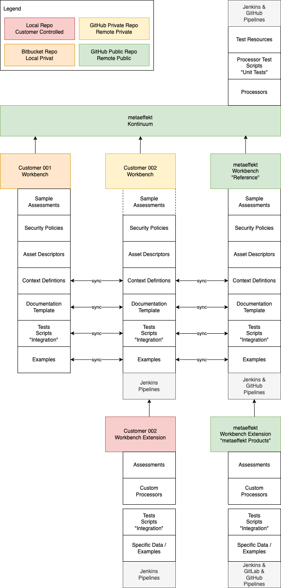

# {metæffekt} Kontinuum

The {metæffekt} Kontinuum repository aggregates baseline configurations to support using the 
{metæffekt} plugins, tools and content.

## Getting started

For getting started see [Getting Started](GETTING_STARTED.md). The readme provides some basic steps using the repository.

## Processors

To enable broad adoption the Kontinuum uses Maven as an integration level. Yet, for specific tasks, isolated
task definitions are provided as individual .xml files in the `processors` folder. Every .xml file defines
a process step in analogy to an isolated workflow engine task.

On the integration level the processors can be combined to define pipelines and workflows.

For further details see [Processors](processors/README.md).

* [Processors](processors/README.md)
  * [advise_attach-metadata](processors/advise/advise_attach-metadata.md)
  * [advise_create-dashboard](processors/advise/advise_create-dashboard.md)
  * [advise_enrich-inventory](processors/advise/advise_enrich-inventory.md)
  * [advise_enrich-with-reference](processors/advise/advise_enrich-with-reference.md)
  * [analyze_resolve-inventory](processors/analyze/analyze_resolve-inventory.md)
  * [convert_cyclonedx-to-inventory](processors/convert/convert_cyclonedx-to-inventory.md)
  * [convert_inventory-to-cyclonedx](processors/convert/convert_inventory-to-cyclonedx.md)
  * [convert_inventory-to-spdx](processors/convert/convert_inventory-to-spdx.md)
  * [portfolio_copy-resources](processors/portfolio/portfolio_copy-resources.md)
  * [portfolio_create-overview](processors/portfolio/portfolio_create-overview.md)
  * [report_create-document](processors/report/report_create-document.md)
  * [scan_scan-inventory](processors/scan/scan_scan-inventory.md)
  * [util_aggregate-sources](processors/util/util_aggregate-sources.md)
  * [util_copy-inventories](processors/util/util_copy-inventories.md)
  * [util_create-diff](processors/util/util_create-diff.md)
  * [util_merge-filter](processors/util/util_merge-filter.md)
  * [util_merge-inventories](processors/util/util_merge-inventories.md)
  * [util_portfolio-download](processors/util/util_portfolio-download.md)
  * [util_portfolio-download-jars](processors/util/util_portfolio-download-jars.md)
  * [util_portfolio-upload](processors/util/util_portfolio-upload.md)
  * [util_transform-inventories](processors/util/util_transform-inventories.md)
  * [util_update-mirror](processors/util/util_update-mirror.md)
  * [util_validate-reference-inventory](processors/util/util_validate-reference-inventory.md))

## Integration

Integration of the {metæffekt} processors is manifold. The following diagram illustrates the anticipated integration
scenarios on repository level.

The {metæffekt} Kontinuum provides the infrastructure to set up integration projects referred to as workbenches. 
Workbenches may exist in different repositories of different parties and with varying audiences.

{metæffekt} provides the {metæffekt} Workbench as public repository to provide a reference for project- or
customer-specific workbenches. In the concrete application we anticipate Workbench Extensions to supply sufficient
context information and to enable sophisticated, version-controlled monitoring and reporting features for everyone.
