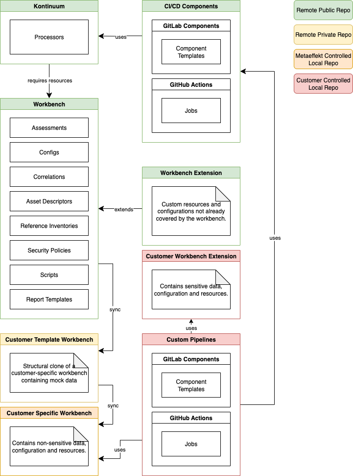

# {metæffekt} kontinuum

The {metæffekt} kontinuum repository provides a series of base-configurations to support using the {metæffekt} plugins, 
tools and content. All configurations can be found in the [processors](processors) directory with their respective
documentation.

## Getting started

To quickly get setup and work with the {metæffekt} kontinuum or integrate it into other projects, take a look at the
[Getting Started](GETTING_STARTED.md) documentation.

## Use Cases

The {metæffekt} kontinuum supports a set of use cases in the following fields:
* Software Composition Analysis
* License and Copyright Scanning
* Vulnerability Correlation, Monitoring, and Assessment
* Creating Compliance Artifacts such as License Documentation and different types of Vulnerability Reports

See also the use cases detailed in [{metæffekt} bom essentials](https://github.com/org-metaeffekt/metaeffekt-bom-essentials?tab=readme-ov-file#sbom-use-cases).

## Processors

To enable broad compatibility the kontinuum provides all processors as .xml files, which can be executed via the
maven build tool. Every processor defines the steps necessary to execute a specific goal, as well as the configuration
parameters required to successfully run it.

Multiple processors can be combined to define pipelines and workflows for integration into larger projects. Reusable
CI/CD components for GitLab are available in the
[metaeffekt-components](https://gitlab.opencode.de/metaeffekt/metaeffekt-components) repository.

For further details see the processor-specific `.md` files under [processors](processors).
    
## Integration

Integration of the {metæffekt} processors is manifold. The following diagram illustrates the anticipated integration
scenarios on repository level.

The {metæffekt} kontinuum provides an interface to execute {metæffekt} plugins and tools. The necessary resources
and configurations are deposited in a [{metæffekt} workbench](https://github.com/org-metaeffekt/metaeffekt-workbench) 
project which, depending on the information contained
within, can either be public / private on a remote repository such as GitHub or privately hosted at {metæffekt}.
Any additional requirements not covered by the workbench will be contained in a workbench-extension project, which
can be a locally hosted customer controlled repository.

Reusable CI/CD components are available for GitLab pipelines. An example of their use is available in
[metaeffekt-examples](https://gitlab.opencode.de/metaeffekt/metaeffekt-examples).

Generally speaking any templates or examples created by {metæffekt} meant as a reference for custom projects will be 
available in a public repository while other data is stored increasingly more private and secure, depending on 
the nature of the data.
