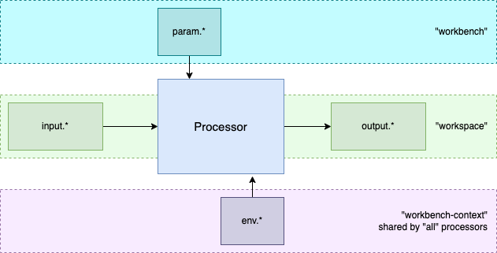

# {metaeffekt} Processors

## Purpose and Function

This folder contains a set of Maven POM files (ending with .xml) and a set of corresponding markdown files (ending with 
.md) describing the purpose and details of the POM files. 

Each POM file addresses a particular task in the pipeline. The POM files serve as a blueprint for a task and can be 
parameterized and executed. Please check the markdown files on the individual POMs for details.

Each processor has user-controlled inputs, outputs and other params and environment settings. The user does not need a 
full understanding of the implementation of each processor. For detailed examples of how to control the processors and 
structure a project, please refer to the scripts at test/scripts/scripts-sh. The scripts show a basic execution of each 
processor with minimal parameterization. For optional parameters to further control each processor, please refer to the 
markdown documentation of each processor.

The POM files are platform independent configurations that can be combined into a workflow. The workflows are either 
defined by job-executor-specific actions/steps (GitHub, GitLab) or pipelines (i.e. Jenkins pipelines).

## Available Processors

### Util

* Aggregate Sources [util_aggregate-sources](util/util_aggregate-sources.md)
* Copy Inventories [util_copy-inventories](util/util_copy-inventories.md)
* Create Diff [util_create-diff](util/util_create-diff.md)
* Merge and Filter [util_merge-filter](util/util_merge-filter-inventories.md)
* Merge Inventories[util_merge-inventories](util/util_merge-inventories.md)
* Portfolio Download [util_portfolio-download](util/util_portfolio-download.md)
* Portfolio Upload [util_portfolio-upload](util/util_portfolio-upload.md)
* Transform Inventories [util_transform-inventories](util/util_transform-inventories.md)
* Validate Reference Inventory [util_validate-reference-inventory](util/util_validate-reference-inventory.md)

### Analyze
* Resolve Artifacts in Inventory [analyze_resolve-inventory](analyze_resolve-inventory.md)

### Advise

* Attach Asset Metadata [advise_attach-metadata](advise_attach-metadata.md)
* Create Vulnerability Assessment Dashboard [badvise_create-dashboard](advise_create-dashboard.md)
* Enrich Inventory with Vulnerability/Advisory Data [advise_enrich-inventory](advise_enrich-inventory.md)
* Enrich Inventory with Curated Data [advise_enrich-reference](advise_enrich-reference.md)

### Convert

* Convert CycloneDX to inventory [convert_cyclonedx-to-inventory](convert/convert_cyclonedx-to-inventory.md)
* Convert Inventory to CycloneDX [convert_inventory-to-cyclonedx](convert/convert_inventory-to-cyclonedx.md)
* Convert Inventory to SPDX [convert_inventory-to-spdx](convert/convert_inventory-to-spdx.md)

### Extract

* Extract Scan Directory [extract_scan-directory](extract/extract_scan-directory.md)

### Mirror

* Download Data Sources [mirror_download-data-sources](mirror/mirror_download-data-sources.md)
* Update Index [mirror_update-index](mirror/mirror_update-index.md)
* Download Index [mirror_download-index](mirror/mirror_download-index.md)

### Portfolio Overview

* Aggregate Portfolio Resources [portfolio_copy-resources](portfolio_copy-resources.md)
* Create Portfolio Overview [portfolio_create-overview](portfolio_create-overview.md)

### Scan

* Scan Inventory [scan_scan-inventory](scan/scan_scan-inventory.md)

### Report

* Create Document [report_create-document](report/report_create-document.md)

### Diff 

* Diff Vulnerability-enriched Inventories [diff_create-diff](diff_create-diff.md)

## Processor Conventions

Each processor requires a series of parameters to be set to function correctly. The required and optional parameters
are grouped into three categories, input / output, parameters and environment.

### Input / Output

Input / output parameters usually describe files or directories which the processor requires to run.
These can be in the form of configuration files, inventories, SBOMs, property-files and so on.

Parameters in this category are prefixed with:
- input
- output

And suffixed with:
- file
- dir
- path

### Parameters
The "parameters" category simply describes any additional parameters which are needed for the processor to run or to
configure the processors flow and influence the output.

Parameters in this category are prefixed with:
- param

Suffixed with:
- enabled (for parameters which can be true or false)

### Environment
Environment parameters describe a series of prerequisites which are not necessarily specific to this single processor.
They usually describe directories or config files containing resources required by multiple processors which can be
shared project-wide. Examples are the vulnerability database, Maven mirror etc.

Parameters in this category are prefixed with:
- env

### Enforcers

Each processor needs to enforce its required parameters using the Maven Enforcer plugin. Please refer to any processor
for an example usage of such enforcers. The enforcer plugin is the very last plugin each processor contains. It defines 
each required parameter listed in the corresponding .md as 'requireProperty' without using the 'message' tag.

### Further Reading
* [Getting Started](GETTING_STARTED.md)
* [Processors](processors/README.md)
* [Tests](tests/README.md)
