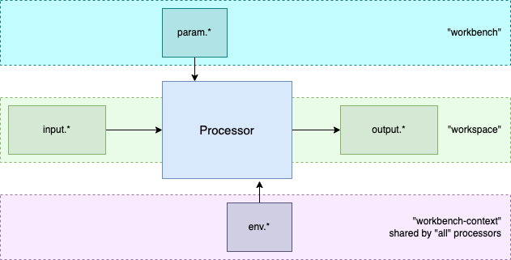

# Processors

## Purpose and Function

This directory contains a set of XML files containing different maven executions and parameters. Each processors funciton
and parameters and documented via markdown files. Each processor file addresses a particular task in the pipeline. The processors serve as a blueprint for a task and can be 
parameterized and executed. 

Each processor has user-controlled inputs, outputs and other parameters and environment settings. The user does not need a 
full understanding of the implementation of each processor. To execute most processors, a set of additional resources
is required, which can be found in the [metaeffekt-workbench](https://github.com/org-metaeffekt/metaeffekt-workbench).
To quickly find out which parameters are required to execute a parameter take a look at the respective markdown file for a
specific processors.

## Processor Conventions

Each processor requires a series of parameters to be set to function correctly. The required and optional parameters
are grouped into three categories, input / output, parameters and environment.

### Input / Output

Input / output parameters usually describe files or directories which the processor requires to run.
These are usually found in the workspace.

Parameters in this category are prefixed with:
- input
- output

### Parameters
The "parameters" category simply describes any additional parameters which are needed for the processor to run or to
configure the processors flow and influence the output. These parameters can either be configuration files found
in the workbench or stand-alone options.

Parameters in this category are prefixed with:
- param

### Environment
Environment parameters describe a series of prerequisites which are not necessarily specific to this single processor.
They usually describe external resources such as the vulnerability mirror or running services.

Parameters in this category are prefixed with:
- env
