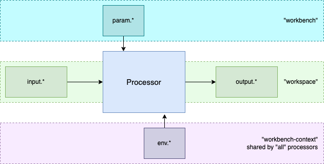

# Processors

## Purpose and Function

This directory contains Maven XML files that define parameterized processor tasks. Each processor XML has a
same-named Markdown file documenting its function and parameters. Processors can be combined to form pipeline
workflows.



Each processor has user-controlled inputs, outputs, parameters, and environment settings. To execute most processors,
additional resources from the [metaeffekt-workbench](https://github.com/org-metaeffekt/metaeffekt-workbench) may be
required. See the processor's Markdown file for its required parameters and resources.

## Running a Processor

Run a processor XML directly with Maven from the repository root, using the `process-resources` goal and passing the
properties documented for that processor as `-D` arguments. For example:

```bash
mvn -f processors/fetch/fetch_download-maven-artifact.xml process-resources \
  -Dparam.group.id=org.apache.commons \
  -Dparam.artifact.id=commons-lang3 \
  -Dparam.version=3.14.0 \
  -Doutput.asset.dir=/tmp/maven-asset
```

The example downloads the artifact into the specified output directory. Replace the values with the parameters listed
in the relevant processor Markdown file.

## Processor Conventions

Each processor requires properties to be set to function correctly. The required and optional properties are grouped
into three categories: input/output, parameters, and environment. Pass them to Maven with the prefixes shown below.

### Input / Output

Input / output parameters usually describe files or directories which the processor requires to run.
These are usually found in the workspace.

Properties in this category use the prefixes `input.` and `output.`.

### Parameters
The "parameters" category simply describes any additional parameters which are needed for the processor to run or to
configure the processors flow and influence the output. These parameters can either be configuration files found
in the workbench or stand-alone options.

Properties in this category use the prefix `param.`.

### Environment
Environment parameters describe a series of prerequisites which are not necessarily specific to this single processor.
They usually describe external resources such as the vulnerability mirror or running services.

Properties in this category use the prefix `env.`.
